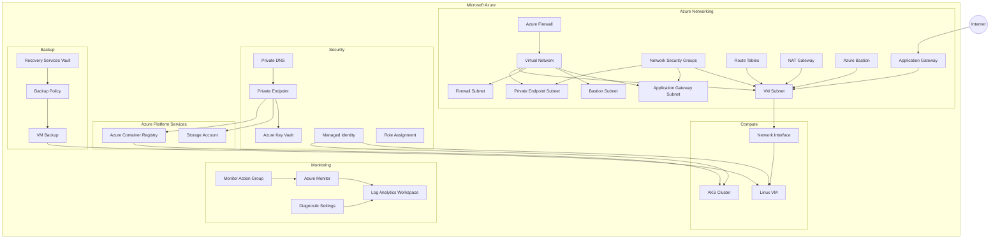

# 🚀 Azure Landing Zone with Terraform


> **A modular Azure Landing Zone implementation using Terraform, designed around reusable Infrastructure as Code, network segmentation, security, private connectivity, monitoring, compute, backup, and application delivery.**

---

## 🎯 Project Overview

This project demonstrates how to build an **Azure Landing Zone using Terraform with a reusable modular architecture**.

The infrastructure is divided into independent Terraform child modules, while environment-specific configuration is maintained under the `environments` directory.

The architecture focuses on:

- Azure Landing Zone principles
- Modular Terraform architecture
- Hub & Spoke networking
- Network segmentation
- Secure workload access
- Private connectivity
- Azure Firewall
- Application Gateway
- Azure Bastion
- Linux Virtual Machines
- AKS
- Azure Container Registry
- Key Vault
- Managed Identity
- Monitoring
- Backup & Recovery
- RBAC
- Infrastructure as Code

---

# 🏗️ High-Level Architecture



---

# 📁 Repository Structure

```text
Azure-Landing-Zone-Terraform/
│
├── environments/
│   └── dev/
│       ├── .terraform.lock.hcl
│       ├── locals.tf
│       ├── main.tf
│       ├── outputs.tf
│       ├── provider.tf
│       ├── variables.tf
│       └── versions.tf
│
├── modules/
│
│   ├── acr/
│   ├── action-group/
│   ├── aks/
│   ├── application-gateway/
│   ├── azure-firewall/
│   ├── backup-policy/
│   ├── bastion/
│   ├── diagnostic-settings/
│   ├── firewall-policy/
│   ├── key-vault/
│   ├── linux-vm/
│   ├── load-balancer/
│   ├── log-analytics/
│   ├── managed-identity/
│   ├── monitor/
│   ├── nat-gateway/
│   ├── nat-gateway-association/
│   ├── network-interface/
│   ├── network-security-group/
│   ├── nsg-association/
│   ├── private-dns/
│   ├── private-endpoint/
│   ├── public-ip/
│   ├── recovery-services-vault/
│   ├── resource-group/
│   ├── role-assignment/
│   ├── route-table/
│   ├── route-table-association/
│   ├── storage-account/
│   ├── storage-container/
│   ├── subnet/
│   ├── virtual-network/
│   └── vm-backup/
│
├── .gitignore
└── README.md
```

---

# 🧩 Modular Terraform Architecture

This project follows a **Parent Configuration → Child Modules** architecture.

```text
Environment
     │
     ▼
Parent Configuration
     │
     ├── Resource Group
     ├── Virtual Network
     ├── Subnet
     ├── NSG
     ├── Route Table
     ├── NAT Gateway
     ├── Firewall
     ├── Public IP
     ├── Network Interface
     ├── VM
     ├── Bastion
     ├── Application Gateway
     ├── AKS
     ├── ACR
     ├── Key Vault
     ├── Private Endpoint
     ├── Private DNS
     ├── Monitoring
     └── Backup
             │
             ▼
       Azure Infrastructure
```

Each child module follows a standard structure:

```text
module-name/
├── main.tf
├── variables.tf
└── outputs.tf
```

Benefits:

- Reusability
- Maintainability
- Consistency
- Easier testing
- Easier code review
- Reduced duplication
- Environment standardization

---

# ☁️ Azure Components

## 📦 Container & Kubernetes

### Azure Container Registry

```text
modules/acr/
```

Provides a private registry for container images.

### Azure Kubernetes Service

```text
modules/aks/
```

Provides the Kubernetes platform for containerized workloads.

---

# 🌐 Networking

### Virtual Network

```text
modules/virtual-network/
```

Creates the Azure Virtual Network.

### Subnet

```text
modules/subnet/
```

Creates workload-specific subnets.

Typical segmentation:

```text
VNet
│
├── Application Gateway Subnet
├── Bastion Subnet
├── Firewall Subnet
├── VM Subnet
└── Private Endpoint Subnet
```

### Network Interface

```text
modules/network-interface/
```

Creates network interfaces used by virtual machines.

### Network Security Group

```text
modules/network-security-group/
```

Provides network-level traffic filtering.

### NSG Association

```text
modules/nsg-association/
```

Associates NSGs with subnets.

### Route Table

```text
modules/route-table/
```

Creates custom route tables for controlled traffic flow.

### Route Table Association

```text
modules/route-table-association/
```

Associates route tables with subnets.

---

# 🔥 Azure Firewall

```text
modules/azure-firewall/
modules/firewall-policy/
```

Provides centralized network security and traffic inspection.

```text
Workload
   │
   ▼
Route Table
   │
   ▼
Azure Firewall
   │
   ▼
Internet / External Network
```

---

# 🌐 NAT Gateway

```text
modules/nat-gateway/
modules/nat-gateway-association/
```

Provides controlled outbound connectivity for private workloads.

```text
Private VM / Workload
        │
        ▼
   NAT Gateway
        │
        ▼
     Internet
```

---

# 🔐 Security

## Azure Key Vault

```text
modules/key-vault/
```

Used for secure management of secrets, keys and certificates.

## Managed Identity

```text
modules/managed-identity/
```

Provides identity-based authentication without embedding credentials in applications.

## Role Assignment

```text
modules/role-assignment/
```

Provides Azure RBAC based authorization.

---

# 🔗 Private Connectivity

## Private Endpoint

```text
modules/private-endpoint/
```

Provides private connectivity to Azure PaaS services.

## Private DNS

```text
modules/private-dns/
```

Provides private name resolution for private endpoints.

```text
VM / AKS
   │
   ▼
Private DNS
   │
   ▼
Private Endpoint
   │
   ▼
Azure PaaS Service
```

---

# 🛡️ Azure Bastion

```text
modules/bastion/
```

Provides secure administrative access to virtual machines without requiring a public IP directly on the VM.

```text
Administrator
      │
      ▼
Azure Bastion
      │
      ▼
Private IP
      │
      ▼
Linux VM
```

---

# 🌍 Application Gateway

```text
modules/application-gateway/
```

Provides Layer-7 application traffic management.

```text
Internet
   │
   ▼
Application Gateway
   │
   ├── Frontend
   │
   └── Backend
          │
          ▼
        VM / AKS
```

---

# ⚖️ Load Balancer

```text
modules/load-balancer/
```

Provides Layer-4 load balancing for supported workloads.

```text
Application Gateway
        │
        └── Layer 7
             HTTP / HTTPS
             URL routing

Load Balancer
        │
        └── Layer 4
             TCP / UDP
```

---

# 🖥️ Compute

## Linux VM

```text
modules/linux-vm/
```

Creates Linux virtual machines.

```text
Linux VM
   │
   ▼
Network Interface
   │
   ▼
VM Subnet
   │
   ▼
Virtual Network
```

---

# 📊 Monitoring & Observability

## Log Analytics

```text
modules/log-analytics/
```

Provides centralized log collection and analysis.

## Azure Monitor

```text
modules/monitor/
```

Provides monitoring capabilities.

## Action Group

```text
modules/action-group/
```

Defines notification/action targets for alerts.

## Diagnostic Settings

```text
modules/diagnostic-settings/
```

Provides centralized collection of resource logs and metrics.

Monitoring flow:

```text
Azure Resources
      │
      ▼
Diagnostic Settings
      │
      ▼
Log Analytics
      │
      ▼
Azure Monitor
      │
      ▼
Action Group
      │
      ▼
Notification
```

---

# 💾 Backup & Recovery

## Recovery Services Vault

```text
modules/recovery-services-vault/
```

Provides Azure Backup infrastructure.

## Backup Policy

```text
modules/backup-policy/
```

Defines backup and retention configuration.

## VM Backup

```text
modules/vm-backup/
```

Associates VM workloads with backup protection.

```text
Linux VM
   │
   ▼
VM Backup
   │
   ▼
Backup Policy
   │
   ▼
Recovery Services Vault
```

---

# 🏢 Resource Organization

Resources can be separated logically by responsibility:

```text
Azure Subscription
│
├── Network Resources
├── Compute Resources
├── Security Resources
├── Storage Resources
└── Monitoring Resources
```

This improves:

- Resource organization
- RBAC management
- Cost visibility
- Governance
- Operations

---

# 🔄 Terraform Dependency Flow

```text
Resource Group
      │
      ▼
Virtual Network
      │
      ▼
Subnets
      │
      ├──────────────┐
      ▼              ▼
     NSG        Route Table
      │              │
      └──────┬───────┘
             ▼
        NIC / Workload
             │
             ▼
        Linux VM / AKS
```

---

# 🚀 Deployment

## 1. Clone Repository

```bash
git clone <YOUR_REPOSITORY_URL>
cd Azure-Landing-Zone-Terraform
```

## 2. Select Environment

```powershell
cd environments/dev
```

## 3. Authenticate to Azure

```powershell
az login
```

Set the required subscription:

```powershell
az account set --subscription "<SUBSCRIPTION_ID>"
```

Verify:

```powershell
az account show
```

---

# ⚙️ Terraform Commands

### Initialize

```powershell
terraform init
```

### Format

```powershell
terraform fmt -recursive
```

### Validate

```powershell
terraform validate
```

### Plan

```powershell
terraform plan
```

### Apply

```powershell
terraform apply
```

### Destroy

```powershell
terraform destroy
```

---

# 🔐 Security & Secrets

Never commit sensitive information into Git.

Do NOT commit:

```text
terraform.tfvars
*.tfstate
*.tfstate.*
.terraform/
```

Recommended `.gitignore`:

```gitignore
.terraform/
*.tfstate
*.tfstate.*
terraform.tfvars
*.tfvars.json
crash.log
crash.*.log
```

Recommended secret-management options:

- Azure Key Vault
- Azure DevOps Secret Variables
- GitHub Secrets
- Managed Identity
- Environment Variables

---

# 🌎 Environment Strategy

Current environment:

```text
environments/
└── dev/
```

The architecture can be extended to:

```text
environments/
├── dev/
├── qa/
├── uat/
└── prod/
```

Each environment can maintain independent:

- Variables
- Backend
- State
- Naming
- Tags
- Network CIDRs
- VM sizes
- Environment-specific settings

The same `modules/` directory can be reused.

---

# 🧪 DevSecOps Roadmap

The Terraform project can be integrated into a DevSecOps pipeline:

```text
Developer
    │
    ▼
Git
    │
    ▼
Terraform
    │
    ├── terraform fmt
    ├── terraform validate
    ├── TFLint
    ├── tfsec
    ├── Checkov
    ├── Trivy
    └── TruffleHog
    │
    ▼
Terraform Plan
    │
    ▼
Approval
    │
    ▼
Terraform Apply
    │
    ▼
Azure Landing Zone
```

---

# 🔭 Future Enhancements

Planned improvements:

- Azure DevOps CI/CD
- Remote Terraform State
- Azure Storage Backend
- State Locking
- TFLint
- tfsec
- Checkov
- Trivy
- Terratest
- TruffleHog
- Infracost
- Azure Policy
- Management Groups
- Subscription Governance
- Microsoft Defender for Cloud
- WAF Policy Hardening
- Private AKS
- Disaster Recovery
- Multi-region Architecture

---

# 🛠️ Technology Stack

```text
Cloud
└── Microsoft Azure

Infrastructure as Code
└── Terraform

Networking
├── VNet
├── Subnet
├── NSG
├── Route Table
├── NAT Gateway
├── Azure Firewall
├── Application Gateway
├── Azure Bastion
└── Private Endpoint

Compute
├── Linux VM
└── AKS

Security
├── Key Vault
├── Managed Identity
├── RBAC
├── Private DNS
└── Firewall Policy

Monitoring
├── Azure Monitor
├── Log Analytics
├── Action Groups
└── Diagnostic Settings

Backup
├── Recovery Services Vault
├── Backup Policy
└── VM Backup

Container Platform
└── Azure Container Registry
```

---

# 🏆 Project Highlights

This project demonstrates practical implementation of:

- Azure Landing Zone
- Terraform Modular Architecture
- Infrastructure as Code
- Hub & Spoke Networking
- Network Segmentation
- Azure Firewall
- Application Gateway
- Azure Bastion
- Private Endpoints
- Private DNS
- Linux Virtual Machines
- AKS
- Azure Container Registry
- Key Vault
- Managed Identity
- RBAC
- Azure Monitor
- Log Analytics
- Backup & Recovery
- Environment-based Infrastructure
- Reusable Terraform Modules

---

# 👨‍💻 Author

## Gunjan Kumar Gaurav

**Senior Cloud & DevSecOps Consultant**

**Azure | Terraform | DevSecOps | Cloud Architecture | Automation | GenAI**

---

## ⭐ Support the Project

If this project helps you understand Azure Landing Zone architecture, consider giving the repository a ⭐ Star.

> **Build infrastructure once. Reuse it everywhere. Automate everything.**

---

### 📜 Project Note

This repository is maintained as a hands-on Azure, Terraform and DevSecOps learning/portfolio project.

Before production adoption, infrastructure should be reviewed and hardened according to the organization's security, compliance, availability, networking and operational requirements.
